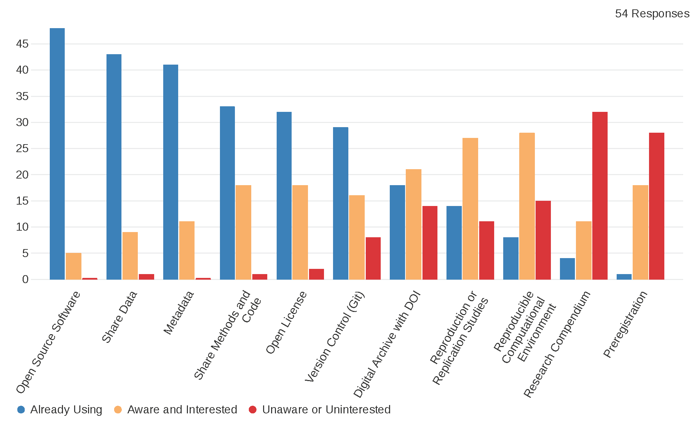

We will conduct three short surveys to establish a baseline of knowledge and interest in open and reproducible research practices and help guide outreach for implementing open and reproducible research practices in new research and teaching programs.

The timing of the surveys will be:

1. At the beginning of the workshop
2. Shortly following the workshop
3. One academic year after the workshop.

We will share survey results here.

You may read the [informed consent document](assets/IRB_Consent.pdf) for the survey instrument.

At the beginning of the workshop, 54 participants reported their engagement with eleven open and reproducible research practices. Results are shown below.

